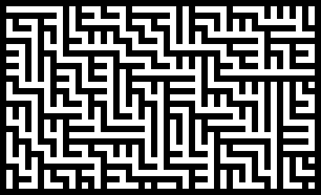

Literal actual years ago, [a friend of mine]() asked me for a blog post about how I generate images with code. I've started writing this blog post on multiple occasions, and I keep wanting to add more stuff, more asides, more examples, and it grows well beyond what a post should be. So instead, I'm going to break it up into multiple posts.

1. [In praise of Netpbm]()
2. Cairo, SVG, and generated vector images: _planned_
3. Practical PostScript—no, why are you laughing, I'm serious: _planned_
4. How I approach procedural images: _planned_

# Generative pixel art

Sometimes the generative art I want to make is just pixel-based. For example, let's say I want to create some interesting [cellular automata](https://en.wikipedia.org/wiki/Cellular_automaton):


Or perhaps I want to make some cool-looking glyphs, the kind you'd see used as writing in the background of a pixel-art-heavy game like [Hyper Light Drifter](https://heartmachine.com/hyper-light) or [Fez](http://fezgame.com/):


Or maybe something kind of maze-like:



There are a lot of ways to go about this, but for images like these I've got a particular approach which is barebones and flexible.

# Say you want to generate some pixel art

For didactic reasons that'll become apparent later in the blog post, I'm going to write code here in [Wren](https://wren.io/). Wren's a little object-oriented scripting language that's designed to be embedded in larger programs. I'm mostly not gonna explain it much, but it should be easy to follow it like it's pseudocode: it's an imperative object-oriented language that feels somewhere between Ruby and JavaScript with a pretty standard curly-brace syntax. I'm not gonna embed it as a scripting language, though: I just want to use it to create some basic black-and-white pixel art, so I'm gonna use [wren-cli](https://wren.io/cli/) to run scripts directly with access to its pretty minimal standard library.

So, pixels. A raster image is just a two-dimensional array, right? How hard can that be? Let's start by making an array of arrays that will be our image[^arr]. Since this is black-and-white, each element will be one of two numbers: for this example, I'll use `0` for white and `1` for black. I'll initialize a basic 3×3 image with all white pixels, by which I mean, make a 3×3 2D array[^mut].

```wren
«pbm/init»
```

[^arr]: Okay, you don't _have_ to use a 2D array. For example, you could also use a flat array of `width * height` elements: assuming you're storing this in row-major order, you can get the element at the position `(x, y)` by using the index `x + y * height`. Alternately, if you don't mind being inefficient—and if you're using the approach I outline here, you're probably more interested in your time than the computer's time!—you can use a hashmap or dictionary whose keys are pairs of numbers. I regularly choose different representations for images depending on what one-off image I'm trying to generate.

[^mut]: A lot of languages have some way of automatically creating a list of `n` copies of a repeated element, and Wren is no exception, but you might notice I didn't use it here, in large part because there's a common gotcha with these functions: they often don't deep-clone their argument, which can cause problems where mutations mutate more elements than you'd expect. In Wren's case, I could create a 2D array of zeroes by writing `List.filled(height, List.filled(width, 0))`, but in this case every row is a reference to the same row in memory, so every row of the image would end up being identical. This is a problem common to other imperative languages, so Ruby's `Array.new(height, Array.new(width, 0))` or Python `[[0] * 3] * 3` would have similar problems: because all rows are aliases for the same row in memory, modifying `image[0][0]` would also modify `image[1][0]` and `image[2][0]`. …probably not what you want!

Okay, so we've got our blank image. Let's do something basic: let's make a very simple black-and-white checkerboard pattern by alternating black and white pixels. This is pretty easy to do with the modulus operator:

```wren
«pbm/checkers»
```

In this case, you'll notice that I access the image using `image[y][x]`. This is the opposite of what the usual notation is, but think about why that is: when we print out our 2D array, it looks like this:

```
[[0, 1, 0],
 [1, 0, 1],
 [0, 1, 0]]
```

But that means that `arr[0]` is the row at the top, `arr[1]` is the row beneath, and `arr[2]` is the last row. That means to e.g. get the second pixel of the first row, we'd need to use `arr[0][1]`. A little unusual, but not _too_ hard to remember, and if it's really tripping us up, we can always write some wrapper functions that take the arguments in the correct order.

Okay! We've got our pixel array: let's turn it into an image!

…oh, wait. I chose to write this in Wren, didn't I?[^wren] Here's a thing about Wren: it doesn't have a package manager, or even much of a stdlib. In another language, I might now say, "Okay, let's find the PNG encoder, toss my data at that, and write out a PNG file." But I don't have a PNG encoder on hand to throw the data at[^embed]. How can I take my 2D array and see it as an actual image?

[^wren]: It's almost like I chose this language to make a clunky didactic point…

[^embed]: I could write a C program which pulls in a PNG encoder and exposes it to Wren—indeed, that's sort of how the language expects to be used—but I don't want to muck with that for this blog post.

# Netpbm to the rescue

[Netpbm](https://en.wikipedia.org/wiki/Netpbm) is an image format, or rather, a family of image formats: seven in all. For the purposes of this blog post, I only care about the first three (although I'll describe the last four a bit later.) Let's start with the PBM format itself, where PBM stands for "Portable BitMap". This is a format for bitmap images, in the very literal sense of 'a map of bits': each pixel is 1 bit (i.e. black or white, on or off.) Netpbm is a text-oriented format, so I can write it with a text editor. Here is a hand-written Netpbm file which describes the basic 3×3 image I was generating above:

```
P1
3 3
0 1 0
1 0 1
0 1 0
```

…and that's it. The `P1` at the top says, "I am a Netpbm file," the next line has the width and height of the image in pixels, and then after that are all the values for each individual pixel, `0` for white and `1` for black.

Okay, there's a _little_ bit more to it, but not much: for one, Netpbm files can have comments, which are commonly used to indicate which program created them (although they can't come first: the first two bytes of the file _have_ to be `P1` for it to be recognized by parsers). It's also worth noting that all the whitespace after the width and height is optional, and you don't _need_ to line up the pixels nicely like I did above. The following defines the same image:

```
P1
# check it out
3 3
010101010
```

But that's really it.

So, that's easy! Let's just write that to stdout in our Wren program. I'm going to separate the rows by newlines and the pixels by spaces, but as I said before, it's optional here:

```wren
«pbm/print»
```

Because I've parameterized it by the width and height, I can also tweak those to make my image larger. And now that I've got a PBM file, I can open it in any program which supports the format: and you might be surprised which programs _do_ support it. I can't view it directly in the browser or anything, but there plenty of viewers and editors that do understand it. I've got [Glimpse](https://glimpse-editor.org/) installed, why not try that?


Works just fine! And I could use Glimpse to convert it to another format. There's also a suite of tools called [netpbm](http://netpbm.sourceforge.net/) which are commonly available on Unix-like systems, so I could always run that to convert them to some other format.[^old]

[^old]: That said, the Netpbm tools are very old: at this point, it's likely that you probably haven't even heard of most of the image formats they have converters for!

# What if I want grays or colors?

You'll notice that the PBM format is pretty barebones: it is only capable of describing black-and-white images. So, let's create a grayscale image instead, which means creating a _PGM_ file. Instead of a simple `0`-versus-`1` distinction, we'll have a scale from black to white. Unlike some other formats, the Netpbm format allows us to decide _how_ many levels of gray we have. Let's say we want to create a very similar image except instead of cycling between black and white, we cycle between multiple shades of gray: let's say, arbitrarily, four. We can start with the same blank image, but instead of filling in `0` and `1`, we fill in a wider range of numbers, which for us will range from 0 through 3.

```wren
«pgm/checkers»
```

In order to produce this file type, we start it with `P2` instead, which is the header variant for a grayscale image. We follow it with the width and height, but then we add one more thing: the _maximum depth_. This is the number that will represent white, while `0` will represent black[^black]; any number in between will represent a shade of gray. In a PGM, unlike a PBM, you _do_ need spaces between the individual pixel values, but luckily we were already doing that before. (Newlines between rows are still optional: I just like how they look.)

[^black]: You might notice that the meaning of the numbers is swapped for the PGM format. In the PBM format above, `0` is white and `1` is black. However, if I create a PGM file where the maximum value for a pixel was `1`, then I'd have effectively created a bitmap file, but _reversed_: in a PGM file, `0` is _black_ and the maximum value is _white_. This is a peculiarity of the format, and something you simply need to remember!

```wren
«pgm/print»
```

The end result of this, yet again, is a bitmap like so:


Creating _color_ images with Netpbm is more involved, but only slightly. When I create a color image, I need to supply three values per pixel: red, green, and blue. One way you can represent this is by treating each pixel as a struct with three fields, or a map from color to value. For our purposes, let's say that each pixel is a hashmap with three keys: `"r"`, `"g"`, and `"b"`. Because the pixel values are now things that can be updated in place, we can no longer rely on the `List.filled` trick in order to repeat the same value: if we did that, we would a list that contains many copies of the same hash, whereas we actually want to create a new hash for literally every pixel. So instead, let's convert this to a nested loop. You'll also notice that I decided to define a color depth at the top of the file here, so we can use that variable later:

```wren
«ppm/init»
```

I'm going to arbitrarily choose something weird to draw here: let's say that I want the image to get more red as you go to the right, more green as you go down, and the blue-ness of pixels will alternate in a checkerboard pattern.

```wren
«ppm/checkers»
```

Once we do that, printing the image is easy, and indeed is nearly identical to the PGM version. We need the header `P3`, and we still need a maximum value for the brightness of pixels, but only one which serves as the maximum value for all three colors. The biggest change is that each pixel is now _three_ numbers, not one, but we can accommodate that pretty easily:

```wren
«ppm/print»
```

And the end result:


And there we go! We can produce bitmap images easily, with no library support at all!

# Why Netpbm and not a bitmap library?

There's no shortage of good libraries for manipulating images, many of which have convenient higher-level operations you might need. At the very least, you probably want some kind of blitting operation, to take a set of smaller bitmaps and redraw them onto a larger one.

But there's a good reason to know about the Netpbm format, and a good reason why I've used it in a lot of my pixel art generation projects: you can use it from _literally anywhere_ and without thinking about it much at all! Look at the above programs: I used a language without a native image library and I didn't even use _file IO_, and yet I was able to create bitmap images in less than two dozen lines.

If I want something a bit more sophisticated, I can start to build my own versions of higher-level operations. For example, let's say I want to encapsulate the image in a class, say, with a `pixel(x, y, color)` method I can call. It'd be pretty easy for me to add a `rectangle` method, like so:

```wren
«rectangle/rectangle»
```

Then I could create an image with a handful of randomly-placed rectangles with random shades:

```wren
«rectangle/main»
```

This program, when run, produces output that looks like this:


I chose Wren here mostly because it's vaguely comprehensible if you know just about any object-oriented scripting language but _also_ to show how little support you need to start making these images. I've built Netpbm images using languages which have other robust image library support (like Rust and Python) but I've also used languages where libraries were scarce and I didn't feel like building a PNG encoder or mucking with an FFI: languages like Wren, but also various obscure Scheme variants, Pony, and Idris.

In fact, the examples at the beginning of this post were all written in exactly this way, and in different languages: the three-state cellular automata were [written in Rust](https://github.com/aisamanra/posts/tree/main/in-praise-of-pbm/examples/threecell/src/main.rs), the glyphs [in Ruby](https://github.com/aisamanra/posts/blob/main/in-praise-of-pbm/examples/glyphs/main.rb), and the maze-ish pattern [in Python](https://github.com/aisamanra/posts/blob/main/in-praise-of-pbm/examples/mazelike/mazelike.py), all of them created by writing out Netpbm files to stdout!

# When would I use a bitmap library?

One concern is that NetPBM files are _big_. Not only are they not compressed, they're also written out using ASCII text, which means there's a lot of wasted space. For example, near the beginning of this post, I included an example of cellular automata, which I generated as 99×99-pixel squares. When encoded as a PNG, this image is about 1.9K in size, and when encoded using the uncompressed BMP format, it goes up to a hefty 39K. The PPM file I originally generated is _58K_ in size, around 30× the size of the PNG. For a tiny image, that's _huge_. This isn't a huge problem long-term, because you can easily convert them to a compressed format for storage, but it's worth noting, especially if you're going to be generating a lot of them at once. (I generated 120 random cellular automata images to choose one for this post: those images, each 99 pixel squares, took up about 8M on disk!)

You'll also have increasing problems as your desired drawing primitives get more complicated. The stuff I've done above all involved tight control over placing pixels or groups of pixels, but if I wanted to e.g. composite several images with various transparency modes, I'm going to have to start implementing more and more things manually. At some point, learning a good library becomes a better use of your time.[^text]

[^text]: This is _especially_ true if you ever want to create images with text. At that point, I'd skip pixels and head straight to vector, even if I want the final result to have a chunky look to it!

Finally, this is really only suitable for generating a static image or several in a batch-like environment: that is to say, it's probably not gonna be an ideal choice for any generative task that needs to be done in real-time (like interactive simulations or video games) or even relatively quickly (like generating images on-the-fly for a web site). Your chosen application might be better served again by finding bindings to something like [pixman](http://www.pixman.org/) instead!

# Hey, what about the other four Netpbm variants?

There are other variants of the Netpbm format, which of course use headers `P4` through `P7`. `P4` through `P6` are simply binary variants of `P1` through `P3`: for example, an image with the header `P4` is a packed-binary bitmap. The header section that defines the width and height is effectively identical to the ASCII version—you'd still use a base-10 ASCII representation of the width and height separated by whitespace—but afterwards you use packed binary versions of the values, and usually with a pre-specified color depth as well.

The final variant, `P7`, is only ever binary, and allows you to define more color channels for specific purposes. For example, you can add an alpha channel, something that is lacking in the other bitmap formats.

Honestly? I've never used them. The reason I reach for Netpbm variants is because they're easy to print and also to parse. In theory, a binary Netpbm file is going to be easier to produce and parse than a compressed format like PNG, but I've never had occasion to need _just enough_ efficiency that I'd use a packed binary image format but not want to take it a step further to a compressed format or dedicated library. If I'm pulling in libraries, I might as well do it right!

# What's next for this series?

I've talked about how I produce pixel-art-ish images, but that's actually a relatively small portion of the generative artwork I've done. Most of my generative artwork has been done with vector art, and there are a few approaches I've taken there. That's going to be the topic of my next post, and I'm going to cover the two most common approaches I've taken, one that's similar to the approach described here, and another that's library-supported!
